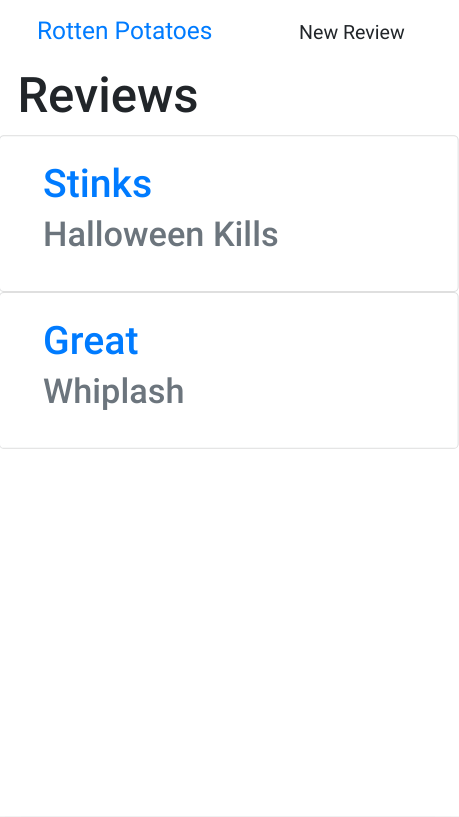
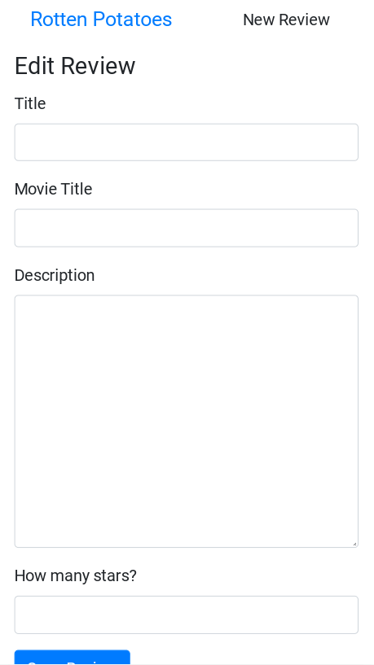
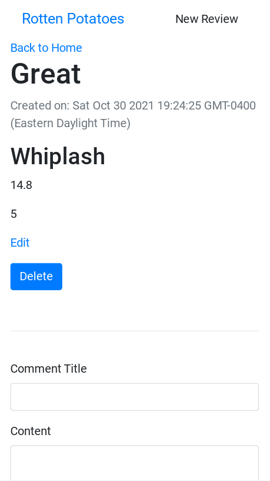

<h1 align="center">Rotten Potatoes</h1>

   Tutorial from  <a href="https://makeschool.org/mediabook/oa/tutorials/rotten-potatoes---movie-reviews-with-express-js/start-an-express-project/" target="_blank">makeschool.org</a>.

## Table of Contents

- [Overview](#overview)
  - [Built With](#built-with)
- [Features](#features)
- [Improvements](#improvements)
- [Useful Resources](#useful-resources)

## Overview

MakeSchool was a coding bootcamp that went under.  Most content was made free and I found this and decided to follow along. 

To run, git clone and add a Mongo connection string from Mongo Atlas.

### Built With

- Express
- Handlebars
- Mongoose

## Features

 Express CRUD example with some tests.

## Improvements

- Handlebars has problems with prototype pollution.  
- Add helmet

### Resources

- [Stack Overflow](https://stackoverflow.com/questions/59690923/handlebars-access-has-been-denied-to-resolve-the-property-from-because-it-is) - handlebars
- [Stack Overflow](https://stackoverflow.com/questions/45980139/how-to-save-selected-dropdown-value-in-mongodb) - select dropdown value
- [Stack Overflow](https://stackoverflow.com/questions/10142643/easy-way-to-add-drop-down-menu-with-1-100-without-doing-100-different-options) - dropdown menu
- [Stack Overflow](https://stackoverflow.com/questions/9722407/how-do-you-install-and-run-mocha-the-node-js-testing-module-getting-mocha-co)- mocha
- [Stack Overflow](https://stackoverflow.com/questions/32375478/error-collection-name-must-be-a-string-in-node-js) - mongoose error
- [Reddit](https://www.reddit.com/r/node/comments/ho1uvk/mongoose_adding_timestamps_to_schema_causes_error/) - timestamps to schema